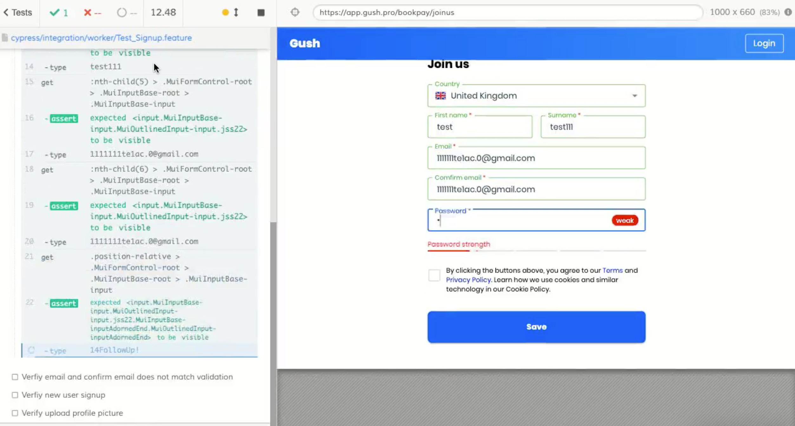

<h1 align="center">Auotomation SignUp form using Cypress  </h1>
 

 
   
  
 

This is a task to Automate [https://app.gush.pro/bookpay/joinus](https://app.gush.pro/bookpay/joinus) website using Cypress and Cucumber with Mochawesome report, Please see below for the Test Case that are automated 

<h1 align="center">Cypress Automation Demo  </h1>

 
  <kbd>
  	<a href="#" target="_blank">
		</img>
	</a>
  </kbd>

## Run Locally 🚀

- git clone : git@github.com:AbdulWahab0/Cypress_Signup_Form.git
- cd Cypress_Signup_Form
- npm install
- npm start

Let me know if you have any questions. [Email Abdul Wahab ](mailto:wahab3060h@gmail.com)

## Technology used:

 - Cypress 
 - Cucumber
 - Mochawesome
 - Jenkins

## Sections 
✔️ Automate Signup form with all fileds\

## Concepts Implemented
- End to End automation tetsing using cypress
- Page Object Model 
- Behavior Driven Development
- Cucmber.js Framework 
-  Mochawesome report
- Development:  Github,
- Cypress-cucumber-preprocesso

## Sections 
✔️ Multiple Cucumber Html Reports\
✔️ Cypress Test Runner with Gherkin Syntax and Cucmber.Js\
✔️ Integrate the cypress with Jenkins build \
✔️ Cypress Command Line Test Results

## Contributors ✨
<table>
  <tr>
    <td align="center"><a href="https://github.com/AbdulWahab0"> <b>Abdul Wahab</b></a> <a href="https://github.com/AbdulWahab0" title="Code">💻</a> <a href="https://github.com/AbdulWahab0" title="Documentation">📖</a> <a href="https://github.com/AbdulWahab0" title="Design">🎨</a> <a href="https://github.com/AbdulWahab0" title="Maintenance">🚧</a></td>
  </tr>
</table>

 

